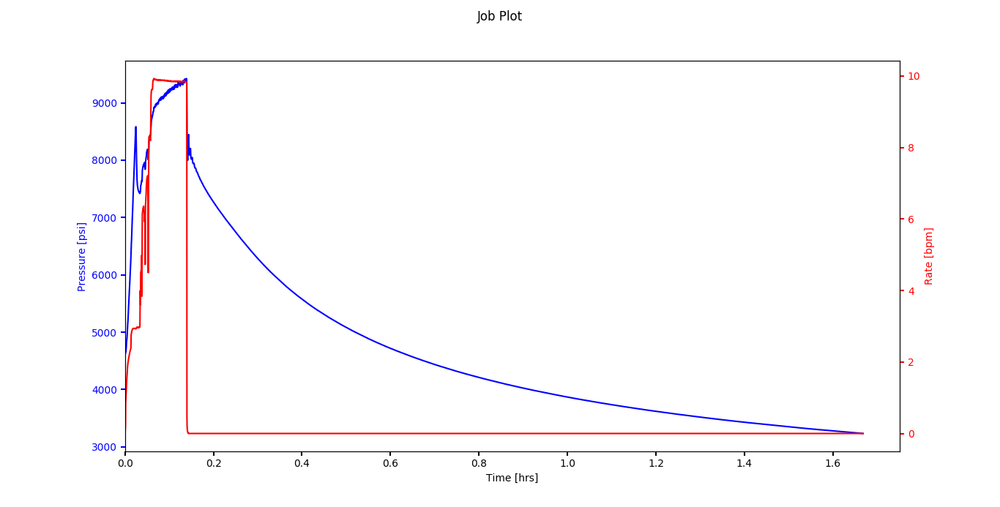
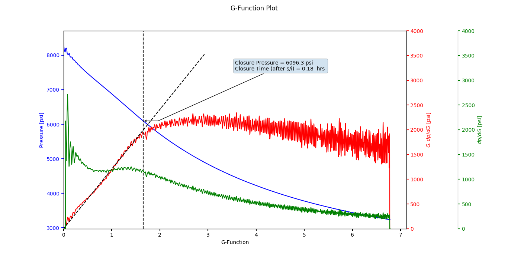
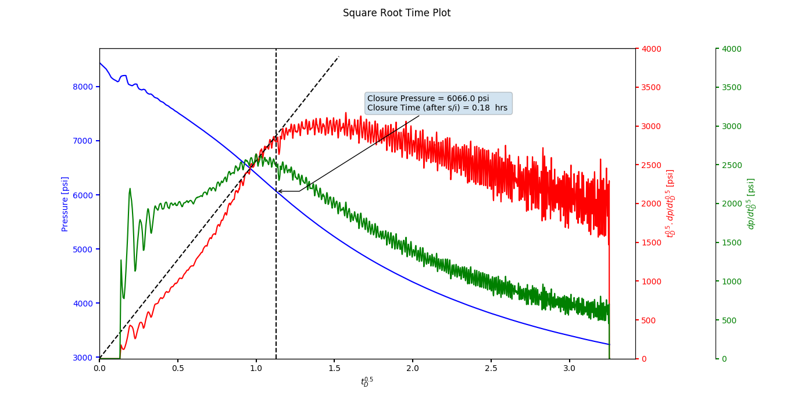

# DFITAnalysis-Python
Diagnostic Fracture Injection Test Analysis Program

This program analyzes the fracture injection/fall off data using standard G-Function and Square Root Time analysis techniques. 

## Requirements
1. Python 3
2. Numpy
3. Matplotlib (with appropraite backends)

## How to use
Open, modify and run `Well_1Analysis.py` file. `Well_1Analysis.py` script loads data from `DFITData.csv` file. It requires time, pressure and rate data as columns, which can be chosen as `t_col`, `p_col` and `r_col` respectively. Header rows may also be skipped with `skip_rows`. Most importantly, the injection time (seconds) is also required and inputted as `tp`.

Following line loads and creates the well object, and makes it ready for further analysis.
```
Well_1 = DFITAnalysis(filename, skip_rows, t_col - 1, p_col - 1, r_col - 1, tp)
```

### Run all
The script will automatically run both: G-function and square root time analyses. `Well_1.runAll(...)` may be commented out if the user requires only one of the analysis or wants to run it interactively. In which case, following instructions must be followed.

### G-Function analysis
G-function analysis can then be called on the above (Well_1) object as follows (run once):
```
  Well_1.GFunction.analysis(Well_1, dwindow)
```

Multiple G-function plot(s) can be prepared as:
```
  Well_1.GFunction.plotData(Well_1, 0, 0, 0, 0, 0, 0, 0, 0)
```

Finally the user can choose a straight line through the origin, followed by identifying closure point (for each plot):
```
  Well_1.GFunction.identifyClosure(Well_1)
```
  
After running, the program will report the closure pressure on console as well as an annotation on the figure.

### Square root time analysis
Similar to above, square root time analysis may also be performed by replacing `GFunction` with `SquareRoot` in the above code.

## Quirks
1. Use the `dwindow` parameter to adjust the smoothness of the derivative, depending on your data.
2. If the lines seem to plot outside the chart, limits may be adjusted while calling `plotData` function.


## Sample data output figures




## Further reading
1. ![Barree slides] https://barree.net/images/documents/c5-pre-frac-injection-tests.pdf

